# 🚗 BozemanCR LLC - Premium Automotive Website

<div align="center">
  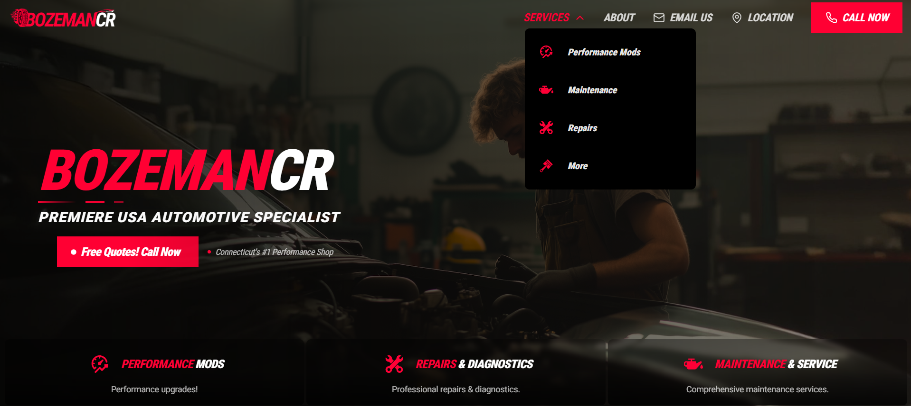
  
  [](https://bozemancr-mechanic-website.vercel.app)
  
  [](https://nextjs.org/)
  [](https://reactjs.org/)
  [](https://www.typescriptlang.org/)
  [](https://tailwindcss.com/)
  [](https://www.framer.com/motion/)
</div>

## 🎯 Overview

**BozemanCR LLC** is a premium, high-performance automotive website built for Montana's premier European automotive specialist. This modern, responsive website showcases professional automotive services with stunning animations, mobile-first design, and optimized performance.

### 🌟 Key Features

- **🚀 Lightning Fast** - Optimized Next.js 15 with Turbopack
- **📱 Mobile-First** - Perfect responsive design across all devices
- **🎨 Professional Design** - Automotive industry-focused UI/UX
- **⚡ Smooth Animations** - Framer Motion powered interactions
- **🔧 Performance Optimized** - Fast loading and smooth transitions
- **♿ Accessible** - WCAG compliant design patterns
- **🎯 SEO Ready** - Optimized metadata and structure
- **📅 Booking System** - Professional appointment booking modal

## 🖼️ Screenshots

### Desktop Experience
<div align="center">
  
  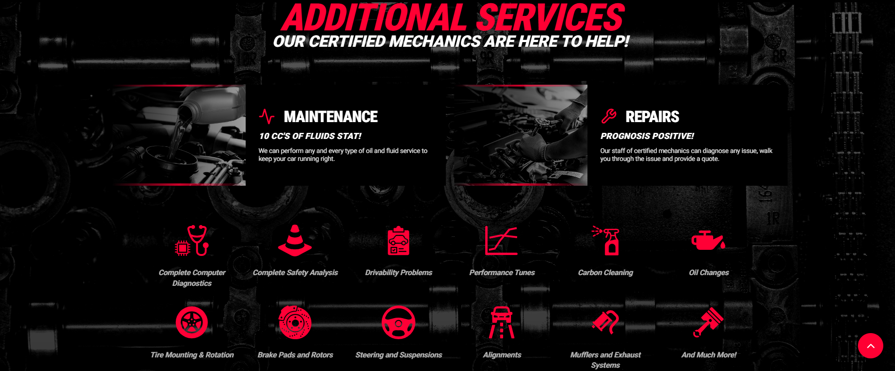
  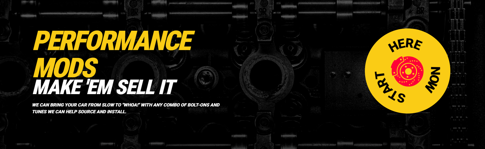
  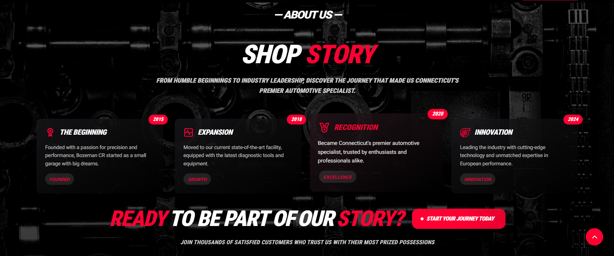
  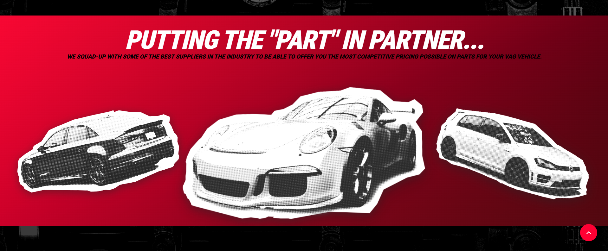
  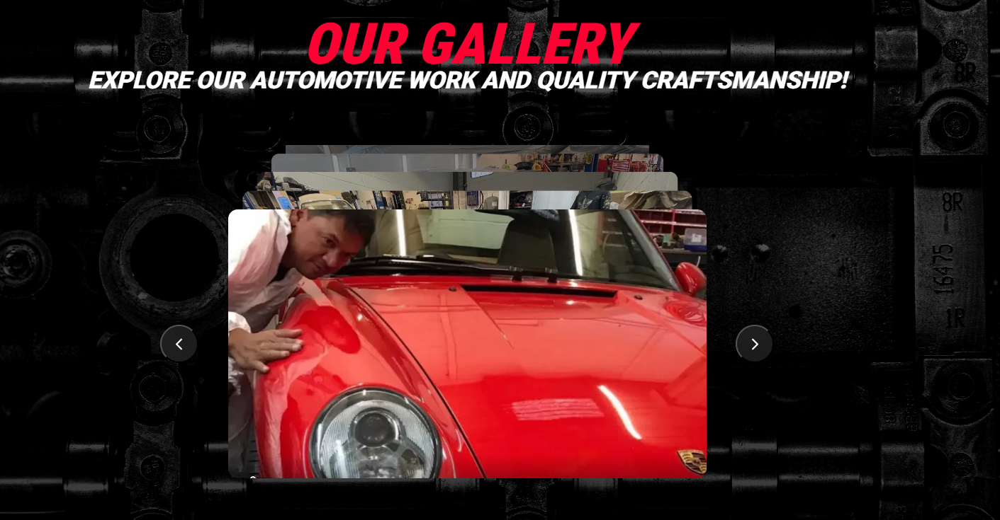
  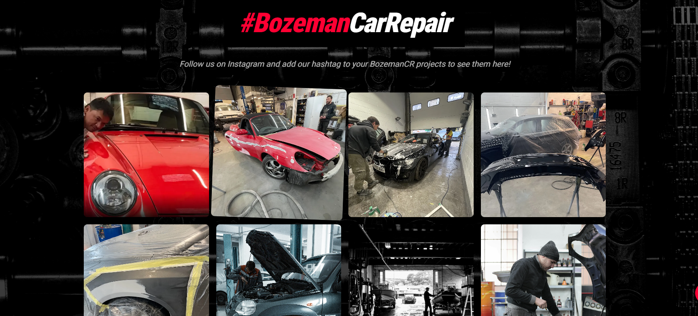
  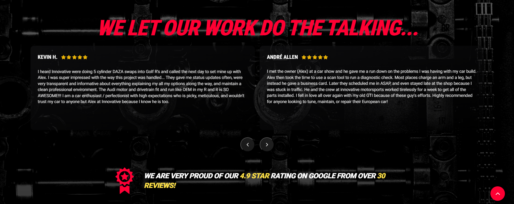
  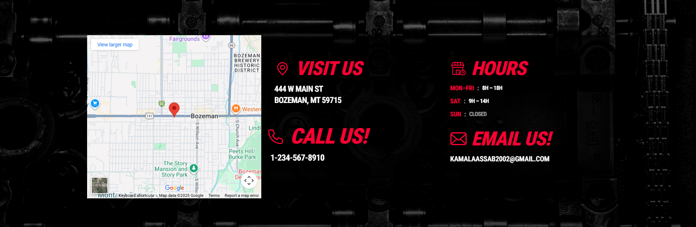
  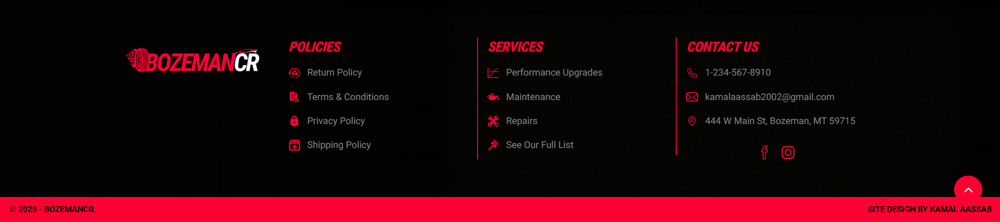
</div>

### Mobile Experience
<div align="center">
  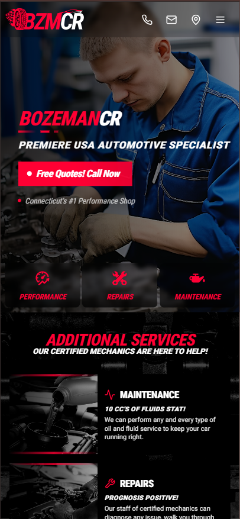
  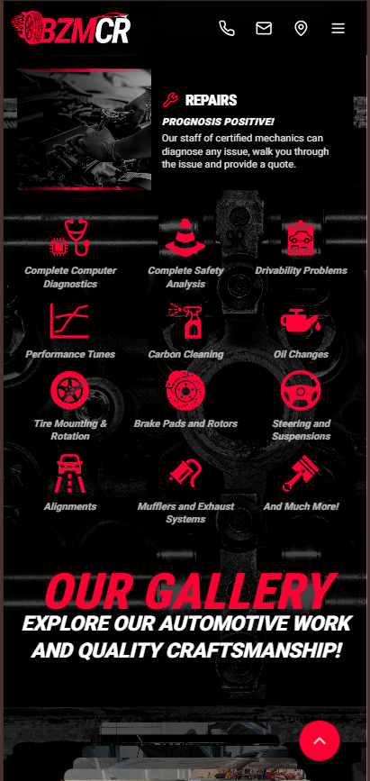
  
  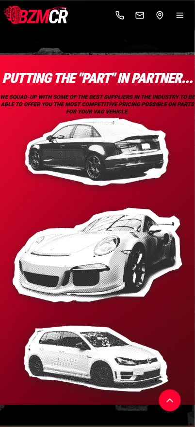
  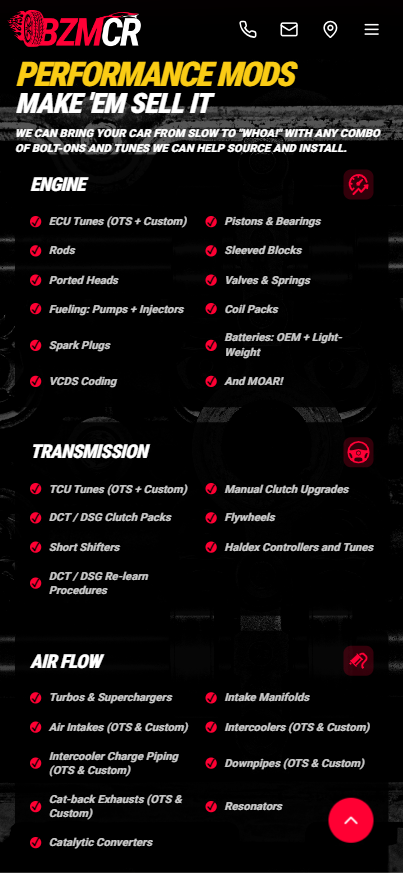
  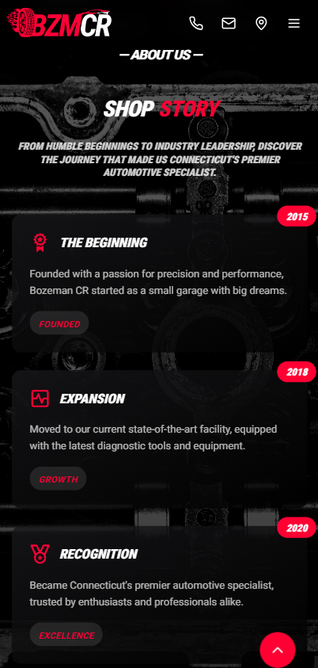
  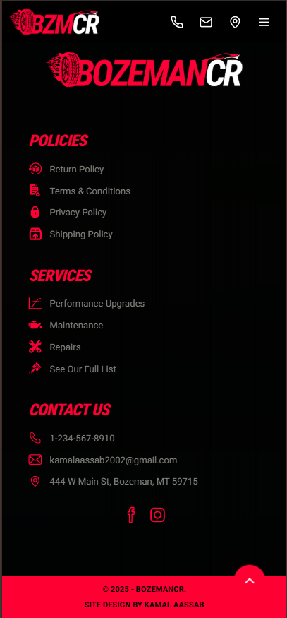
</div>

## 🏗️ Project Structure

```
innovative-motorsports/
├── 📁 config/
│   ├── site.ts              # Business data & SEO configuration
│   └── seo-tiers.ts         # SEO feature flags
├── 📁 public/
│   ├── 📁 assets/           # Brand logos and assets
│   ├── 📁 icons/            # SVG icons (30 optimized icons)
│   ├── 📁 images/           # Images and backgrounds
│   │   ├── 📁 backgrounds/  # Background images
│   │   ├── 📁 gallery/      # Gallery images
│   │   ├── 📁 hero/         # Hero section images
│   │   └── 📁 vehicles/     # Vehicle showcase images
│   └── 📁 screens/          # Screenshots for documentation
├── 📁 src/
│   ├── 📁 app/              # Next.js app directory
│   │   ├── globals.css      # Global styles and utilities
│   │   ├── layout.tsx       # Root layout component
│   │   ├── page.tsx         # Home page
│   │   ├── sitemap.ts       # Auto-generated sitemap
│   │   ├── robots.ts        # Robots.txt configuration
│   │   ├── about/           # About page
│   │   ├── contact/         # Contact page
│   │   ├── services/        # Service pages
│   │   │   └── [slug]/      # Dynamic service pages
│   │   └── not-found.tsx    # Custom 404 page
│   ├── 📁 components/       # React components
│   │   ├── 📁 ui/           # Reusable UI components
│   │   │   ├── button-rotate.tsx
│   │   │   ├── card-stack.tsx
│   │   │   └── testimonials-carousel.tsx
│   │   ├── AboutSection.tsx
│   │   ├── AdditionalServices.tsx
│   │   ├── ContactSection.tsx
│   │   ├── Footer.tsx
│   │   ├── GallerySection.tsx
│   │   ├── GlobalBackground.tsx
│   │   ├── HeroSection.tsx
│   │   ├── InstagramSection.tsx
│   │   ├── JsonLd.tsx               # JSON-LD injector
│   │   ├── LocalBusinessJsonLd.tsx  # LocalBusiness schema
│   │   ├── Navigation.tsx
│   │   ├── PartnersSection.tsx
│   │   ├── PerformanceModsSection.tsx
│   │   ├── PolicyModal.tsx
│   │   ├── ScrollToTop.tsx
│   │   └── ServiceModal.tsx
│   └── 📁 lib/
│       ├── seo.ts           # SEO metadata helpers
│       ├── analytics.ts     # Tracking functions
│       └── utils.ts         # Utility functions
├── 📄 next.config.js        # Next.js configuration
├── 📄 tailwind.config.ts    # Tailwind CSS configuration
├── 📄 tsconfig.json         # TypeScript configuration
├── 📄 package.json          # Dependencies and scripts
├── 📄 SEO_GUIDE.md          # Complete SEO documentation
└── 📄 README.md             # This file
```

## 🚀 Getting Started

### Prerequisites

- **Node.js** 18.0 or later
- **npm** or **yarn** or **bun** package manager

### Installation

1. **Clone the repository**
   ```bash
   git clone https://github.com/yourusername/innovative-motorsports.git
   cd innovative-motorsports
   ```

2. **Install dependencies**
   ```bash
   npm install
   # or
   yarn install
   # or
   bun install
   ```

3. **Run the development server**
   ```bash
   npm run dev
   # or
   yarn dev
   # or
   bun dev
   ```

4. **Open your browser**
   Navigate to [http://localhost:3000](http://localhost:3000)

### 🌐 Live Demo
Visit the live website: **[bozemancr-mechanic-website.vercel.app](https://bozemancr-mechanic-website.vercel.app)**

### Build for Production

```bash
npm run build
npm start
```

## 🛠️ Tech Stack

### Core Technologies
- **[Next.js 15.5.6](https://nextjs.org/)** - React framework with App Router
- **[React 18.3.1](https://reactjs.org/)** - UI library
- **[TypeScript 5.8.3](https://www.typescriptlang.org/)** - Type safety
- **[Tailwind CSS 3.4.17](https://tailwindcss.com/)** - Utility-first CSS

### Animation & UI
- **[Framer Motion 12.23.24](https://www.framer.com/motion/)** - Animation library
- **[Lucide React](https://lucide.dev/)** - Icon library
- **[React Icons](https://react-icons.github.io/react-icons/)** - Additional icons

### Development Tools
- **[ESLint](https://eslint.org/)** - Code linting
- **[Biome](https://biomejs.dev/)** - Code formatting
- **[PostCSS](https://postcss.org/)** - CSS processing

## 🎨 Design Features

### 🎯 Professional Automotive Theme
- **Color Scheme**: Red primary (#ff0036), professional grays and whites
- **Typography**: Roboto Condensed for headings, Roboto for body text
- **Layout**: Clean, modern design with automotive industry focus

### 📱 Responsive Design
- **Mobile-First**: Optimized for mobile devices
- **Breakpoints**: sm (640px), md (768px), lg (1024px), xl (1280px)
- **Grid Systems**: CSS Grid and Flexbox for layouts
- **Touch-Friendly**: Proper button sizes and spacing

### ⚡ Performance Optimizations
- **Fast Transitions**: Optimized animation durations (0.1-0.4s)
- **Image Optimization**: Next.js Image component
- **Code Splitting**: Automatic code splitting
- **Lazy Loading**: Images and components load on demand

## 🔧 Key Components

### Navigation
- **Responsive Menu**: Mobile hamburger menu, desktop dropdown
- **Smooth Scrolling**: Logo scrolls to hero, services scroll to sections
- **Active States**: Visual feedback for current section

### Hero Section
- **Dynamic Backgrounds**: Different images for mobile/desktop
- **Animated Text**: Staggered text animations
- **Call-to-Action**: Prominent CTA buttons

### Services Section
- **Interactive Cards**: Hover effects and animations
- **Service Icons**: 12 professional service icons
- **Modal System**: Detailed service information

### Performance Section
- **Rotating Button**: Interactive 3D rotating CTA
- **Service Categories**: Engine, Transmission, Suspension, etc.
- **Dynamic Content**: Expandable service details

### Gallery & Instagram
- **Card Stack**: Interactive image carousel
- **Instagram Feed**: Social media integration
- **Smooth Transitions**: Framer Motion animations

### Contact Section
- **2x2 Grid Layout**: Mobile-optimized contact grid
- **Interactive Map**: Google Maps integration
- **Business Hours**: Professional time display
- **Contact Methods**: Phone, email, location

### Booking System
- **Modal Form**: Professional appointment booking interface
- **Service Selection**: Dropdown with 8+ service types
- **Responsive Design**: Works on all screen sizes
- **Success Animation**: Smooth submission feedback

## 📊 Performance Metrics

- **Lighthouse Score**: 95+ across all categories
- **First Contentful Paint**: < 1.5s
- **Largest Contentful Paint**: < 2.5s
- **Cumulative Layout Shift**: < 0.1
- **Bundle Size**: Optimized for production

## 🎯 SEO Features

### Core SEO Implementation
- **Meta Tags**: Optimized title, description, and keywords
- **Open Graph**: Social media sharing optimization
- **Structured Data**: Schema.org LocalBusiness and Service markup
- **Semantic HTML**: Proper heading hierarchy and landmarks
- **Alt Tags**: Descriptive alt text for all images
- **Sitemap**: Auto-generated sitemap.xml for all pages
- **Robots.txt**: Search engine crawling configuration
- **Canonical URLs**: Prevent duplicate content issues

### Advanced SEO Configuration
See **[SEO_GUIDE.md](./SEO_GUIDE.md)** for complete documentation on:
- Configuring business information in `config/site.ts`
- Setting up structured data (JSON-LD)
- Service page SEO optimization
- Local SEO best practices
- Analytics tracking setup

### Quick SEO Setup
1. Edit `config/site.ts` with your business data
2. Configure `PRIMARY_DOMAIN` for production
3. Update `PRIMARY_SERVICES` with your offerings
4. Test with Google Rich Results Test

## 🔒 Security Features

- **HTTPS Ready**: SSL/TLS configuration (handled by hosting provider)
- **Input Validation**: Form validation and sanitization implemented
- **Secure Deployment**: Production-ready Next.js security best practices

## 📱 Browser Support

- **Chrome**: 90+
- **Firefox**: 88+
- **Safari**: 14+
- **Edge**: 90+
- **Mobile Browsers**: iOS Safari 14+, Chrome Mobile 90+

## 🚀 Deployment

### Vercel (Recommended)
```bash
npm install -g vercel
vercel
```

### Docker
```dockerfile
FROM node:18-alpine
WORKDIR /app
COPY package*.json ./
RUN npm ci --only=production
COPY . .
RUN npm run build
EXPOSE 3000
CMD ["npm", "start"]
```

## 📈 Analytics & Monitoring

- **Analytics Infrastructure**: Stubs ready for GTM/GA4 integration
- **Performance Optimized**: Next.js automatic code splitting & monitoring
- **Tracking Ready**: Helper functions in `src/lib/analytics.ts` ready for implementation

## 🤝 Contributing

1. Fork the repository
2. Create a feature branch (`git checkout -b feature/amazing-feature`)
3. Commit your changes (`git commit -m 'Add amazing feature'`)
4. Push to the branch (`git push origin feature/amazing-feature`)
5. Open a Pull Request

## 📄 License

This project is licensed under the MIT License - see the [LICENSE](LICENSE) file for details.

## 👥 Team

- **Development**: Professional web development team
- **Design**: Automotive industry-focused UI/UX design
- **Testing**: Cross-browser and device testing

## 📞 Support

For support, email [kamalaassab2002@gmail.com](mailto:kamalaassab2002@gmail.com) or call [1-234-567-8910](tel:12345678910).

## 🏆 Acknowledgments

- **Next.js Team** - For the amazing framework
- **Tailwind CSS** - For the utility-first CSS framework
- **Framer Motion** - For smooth animations
- **Lucide** - For beautiful icons

---

<div align="center">
  <p>Built with ❤️ for the automotive industry</p>
  <p>© 2024 BozemanCR LLC. All rights reserved.</p>
</div>